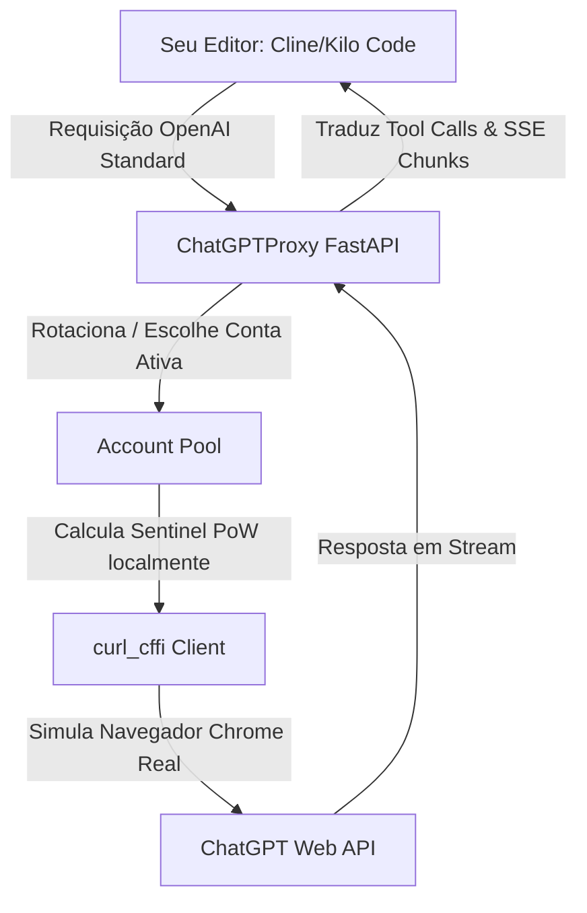

# 🚀 ChatGPTProxy — OpenAI-Compatible API Proxy for ChatGPT Web

[](https://python.org)
[](https://fastapi.tiangolo.com)
[](https://playwright.dev)
[](LICENSE)

**ChatGPTProxy** é um utilitário prático que transforma a interface web gratuita do **ChatGPT (chatgpt.com)** em uma API totalmente compatível com o formato da OpenAI (`/v1/chat/completions`).

Com ele, você pode usar o ChatGPT gratuitamente dentro de qualquer ferramenta de desenvolvimento, como **Cline**, **Kilo Code**, **OpenCode**, **Continue**, **Aider**, **Hermes**, ou qualquer SDK oficial da OpenAI.

---

## ✨ Principais Funcionalidades

* 💸 **100% Gratuito:** Use o poder do ChatGPT diretamente em seus editores sem precisar de chaves de API pagas da OpenAI.
* 🧩 **Tool-Calling por Injeção:** Traduz e injeta ferramentas customizadas no prompt do modelo e converte o retorno para o padrão `tool_calls` da OpenAI automaticamente.
* 🛡️ **Anti-Bloqueios & PoW:** Resolve desafios Sentinel Proof of Work (PoW) localmente em Python de forma ultrarrápida e usa o `curl_cffi` para simular o tráfego do Chrome real e furar o Cloudflare.
* 👥 **Pool Multi-Contas:** Gerencie e rotacione várias contas do ChatGPT automaticamente. O proxy gerencia cooldowns, conta falhas de rede e desabilita temporariamente contas com problemas.
* 🔒 **Login Headless Automático:** Abra um navegador persistente, faça o login uma única vez e o script captura os tokens de sessão e atualiza tudo de forma automática.
* 🚫 **Proteção Contra Sandbox Leak:** Evita que os modelos tentem usar a sandbox interna da OpenAI (Code Interpreter) ao detectar conflitos de diretório raiz.

---

## 🛠️ Como Funciona (Simplificado)



---

## 📋 Requisitos do Sistema

1. **Python 3.10** ou superior instalado no seu sistema.
2. Navegador Google Chrome ou Chromium instalado (o Playwright fará o download se necessário).

---

## 🚀 Passo a Passo para Iniciar (Para Leigos)

Siga estes 3 passos simples para configurar e rodar o proxy na sua máquina:

### Passo 1: Instalar dependências e o navegador do Playwright
Abra um terminal na pasta do projeto e execute os seguintes comandos:
```bash
# 1. Instalar as dependências do Python
pip install -r requirements.txt

# 2. Instalar os drivers do navegador Playwright
playwright install chromium
```

### Passo 2: Fazer Login na sua conta do ChatGPT
Para capturar as credenciais da sua sessão:
1. Dê um clique duplo no arquivo **`login-chatgptproxy.cmd`** (ou execute `python login_chatgpt.py` no terminal).
2. Uma janela real do navegador Chromium se abrirá na página do ChatGPT.
3. **Faça o login** normalmente na sua conta (pode ser conta gratuita ou paga).
4. Assim que você ver a barra lateral com as conversas do ChatGPT, o script irá capturar automaticamente o **Access Token** e os **Cookies**.
5. No terminal, você pode definir um apelido para a conta (ex: `minha-conta-principal`). Pressione **Enter**. As informações serão salvas de forma segura e criptografada apenas na sua máquina no arquivo `accounts.json`.
6. Feche a janela do navegador que se abriu.

### Passo 3: Iniciar o Servidor Proxy
1. Dê um clique duplo no arquivo **`start-chatgptproxy.cmd`** (ou execute `python app.py` no terminal).
2. O script irá limpar a porta 3500 de execuções antigas e subirá o servidor local.
3. Pronto! Seu proxy estará rodando no endereço: `http://localhost:3500`

---

## ⚙️ Configuração nos Clientes / Editores

Para usar o proxy nas suas extensões ou editores de código favoritos:

### 1. Cline / Kilo Code / OpenCode / Continue
Configure a extensão com os seguintes dados:
* **Provider (Provedor):** `OpenAI-Compatible` (ou `Custom / Custom OpenAI`)
* **Base URL:** `http://localhost:3500/v1`
* **API Key:** `chatgpt-local-dev` (Esta é a chave padrão definida no arquivo `.env`)
* **Model ID:** `gpt-4o-mini`, `gpt-4o` ou `gpt-5` (O proxy traduz o modelo para o upstream adequado)

### 2. Hermes Agent (`~/.hermes/config.yaml`)
```yaml
custom_providers:
  - name: chatgptproxy
    base_url: http://localhost:3500/v1
    api_key: chatgpt-local-dev
    api_mode: chat_completions
    model: gpt-4o-mini
```

---

## 👥 Gestão de Múltiplas Contas

Caso queira usar o proxy com várias contas para evitar limites de uso:
1. Clique em `login-chatgptproxy.cmd`.
2. Digite um ID de número diferente para a conta (ex: `2`).
3. Faça o login na conta secundária.
4. O ChatGPTProxy irá rotacionar as requisições de forma equilibrada entre todas as contas ativas do pool. Se alguma receber limite ou falha, o proxy a colocará em cooldown por 10 minutos e tentará com outra conta automaticamente.

---

## 🔍 Resolução de Problemas (FAQ)

### O navegador fecha logo após abrir no passo de login?
Certifique-se de ter rodado `playwright install chromium` no terminal do projeto para instalar os drivers de browser necessários.

### O proxy começou a dar erros HTTP 401 ou 403?
Sua sessão do ChatGPT expirou ou os cookies foram revogados. Basta rodar o arquivo `login-chatgptproxy.cmd` novamente para atualizar a sessão da sua conta correspondente.

### Posso mudar a porta ou a chave de API?
Sim! Crie uma cópia do arquivo `.env.example` com o nome `.env`, altere as variáveis `PORT` e `API_KEY` ao seu gosto, e reinicie o proxy.

---

## 📄 Licença

Este projeto está licenciado sob a licença MIT. Consulte o arquivo [LICENSE](LICENSE) para obter mais informações.

---

Desenvolvido com ❤️ para a comunidade open-source. Se este projeto foi útil para você, dê uma **estrela ⭐ no GitHub**!
